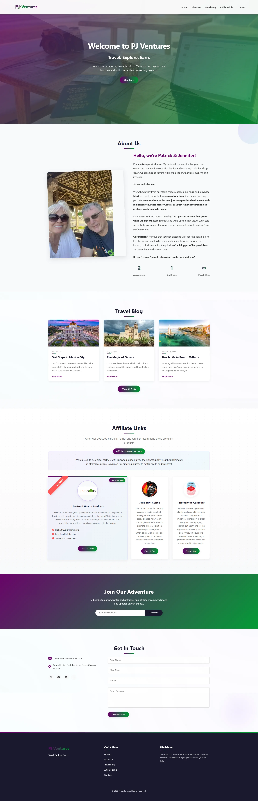

# PJ Ventures Landing Page

Welcome to the official repository for **[www.pjventures.org](https://www.pjventures.org)**, the personal travel and affiliate links landing page for PJ Ventures, owned by Patrick and Jennifer Veach. This site serves as a curated hub for their travel recommendations, affiliate partnerships, and lifestyle content, designed and developed with precision and hosted via GitHub Pages.

---

## 🌟 About PJ Ventures

PJ Ventures is the passion project of Patrick and Jennifer Veach, a duo dedicated to sharing their love for travel and smart living. This landing page, hosted at `www.pjventures.org`, connects visitors to handpicked travel resources and affiliate links, blending functionality with a sleek, user-friendly design.

- **Live Site**: [www.pjventures.org](https://www.pjventures.org)
- **Repository**: [github.com/PJVentures/Portfolio](https://github.com/PJVentures/Portfolio)
- **Status**: ACTIVE 

---

## 🚀 Features

- **Travel & Affiliate Hub**: Links to trusted travel resources and affiliate partners.
- **Responsive Layout**: Optimized for desktop, tablet, and mobile browsing.
- **Branded Design**: Features the PJ Ventures logo (`assets/company/veachLogo.webp`) for a cohesive look.
- **Fast & Lightweight**: Quick load times for a seamless user experience.
- **Custom Domain**: Hosted on GitHub Pages with a custom IONOS domain.

---

## 🛠️ Tech Stack

| Category         | Tools                         |
|------------------|-------------------------------|
| **Frontend**     | HTML5, CSS3, JavaScript       |
| **Assets**       | WebP (e.g., `veachLogo.webp`) |
| **Hosting**      | GitHub Pages                 |
| **Domain**       | IONOS (www.pjventures.org)    |
| **Development**  | VS Code                       |

---

## 📸 Screenshots

  
*Caption: Explore travel and affiliate links at www.pjventures.org*

---

🌐 Custom Domain Setup
The site runs at www.pjventures.org with:

🤝 Contributing
Want to enhance this landing page? Contributions are appreciated:

Fork the repository.
Create a branch (git checkout -b feature/new-links).
Commit changes (git commit -m "Add new affiliate links").
Push your branch (git push origin feature/new-links).
Submit a Pull Request.
Note: Please coordinate with PJ Ventures or their developer before making changes.

📬 Contact PJ Ventures
Reach out to Patrick and Jennifer Veach:
Email: DreamTeam@PJVentures.org
Website: www.pjventures.org
GitHub: PJVentures

✨ Acknowledgments
Hosted by GitHub Pages.
Domain managed by IONOS.
Developed for Patrick and Jennifer Veach of PJ Ventures.
